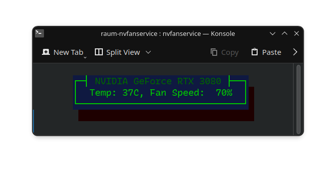
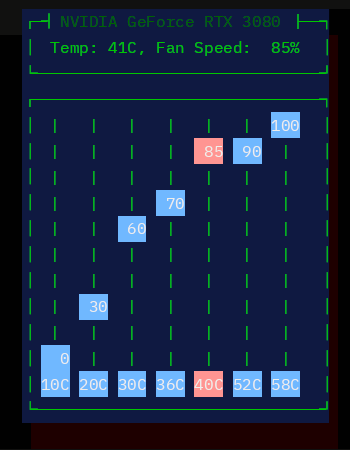

# nvFanService
### Running Wayland and can't use GreenWithEnvy? Relax. Raum brings Fan Service to your nVidia GPU.
No promises. But it just may work.

## Currently:
- Starting temperature/fan speed curve is hard coded
  - Fan curves (UwU) are now partially configurable with a series of sliders
  - Number of sliders and their temperatures are not yet configurable
  - NO safeties are in place and changes to the sliders take effect immediately
- Using the Cursive crate, an ncurses panel is displayed wherein the temp and fan speed are displayed, refreshed every 10 seconds
  - I can envision a future in which one can use their own color theme from a file.
- Testing: It seems to work on Pop!_OS 22.04 LTS and Nobara 40 (Fedora 40 ala GloriusEggroll)
- Uses sudo crate to automatically prompt for password
  - This eases development as I can just `cargo run -r` without trying to `sudo` my `cargo`
  - The code is really short at the moment and easy to peruse as I am just some guy on the internet and it's really quite mad to trust just some guy on the internet. Trust no one. They're coming for you, Barbara.
- press 'q' to quit. No more 'q' then 'Enter' gargage.
  - Side note, it's possible we should be setting the fans back to default on exit and I have not yet looked into this.  I don't know if manually set speeds have a timeout or if I set it to 30% manually it just stays at 30% until told otherwise. So... use at your own risk and whatnot. I've been running the update loop for a couple of days with no instability, and when BG3 gets going, those fans go right to the top. If you prefer the quiet, my hard coded settings may not be for you. I put almost no thought into them.

## Todo:
- Need to finish fan curve customization.
- Hard coded "fan curve" is bad and the current values are for testing purposes so I can hear it working
  - [x] Made a kind of fan curve struct to pass to service_fans()... UwU
  - [x] Said struct is a sorted list of (temp, speed) tuples
  - [x] If there is enough room in the terminal, a "curve editor" is now displayed
  - [ ] Need way to change temperature per slider
  - [ ] Need a was to add/remove sliders (within reason)
  - [ ] Sliders need better theme
  - [ ] Currently we have fixed steps. I think we want to lerp speeds between temps

Good talk...
