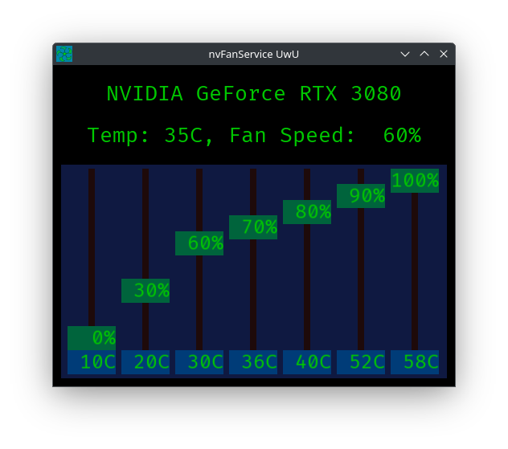
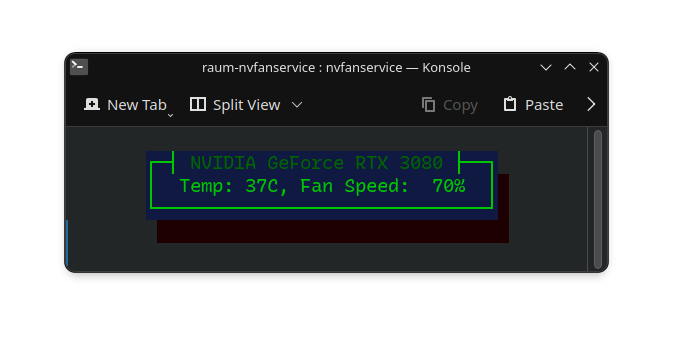
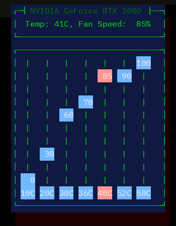

# nvFanService

### Running Wayland and can't use GreenWithEnvy? Relax. Raum brings Fan Service to your nVidia GPU.

No promises. But it just may work.

Default SDL3 version:

Terminal version using `ncurses` via `cursive` crate:

## Compiling:

On Arch, you'll need extra/sdl3 and aur/sdl3_ttf to compile. I guess sdl3 is too new for everything to be on the main repo? Patience, Iago. I assume you'll need to find the equivalent packages on other distros, perhaps even as dev packages, IDK. One day I'll find out and make specific notes.

Also, the font for the SDL3 version is hard coded to `"/usr/share/fonts/TTF/FiraCodeNerdFontMono-Regular.ttf"` and I imagine it will crash without that file. Can I... `include_bytes!()` the font file??? That would make it a compile dependency and not really solve anything, right? This needs to be dealt with somehow... Figure out the most common mono fonts, put them in a list by preference, then load the first one that exists?

## Currently:

- Starting temperature/fan speed curve is hard coded
  - Fan curves (UwU) are now partially configurable with a series of sliders
  - Number of sliders and their temperatures are not yet configurable
  - Changes to the sliders take effect by the next time the temp is polled
    - Temp is polled around every 10 seconds
  - No safety function is in place for a bad fan curve
    - A bad fan curve can potentially cause your card to overheat
    - Setting fan speed to 0%, IIRC, returns control to firmware
    - Therefore, setting speed to 1% across the board is bad
    - Hard coded fan curve is aggressive and potentially loud, but safe(TM)
    - Exiting the program returns control to firmware
- Uses SDL3 by default but can be run in a terminal window with the command line option `cli`. This runs the Cursive/ncurses version, in which case, using the `cursive` crate, an ncurses panel is displayed in which the name of the card along with it's temp and fan speed are displayed, refreshed every 10 seconds~~
  - I can envision a future in which one can use their own color theme from a file.
- Testing: Tested recently on Arch, older versions on `Pop!_OS 22.04 LTS` and `Nobara 40` (Fedora 40 ala GloriusEggroll)
- Uses elevate.rs, my derivative of the `sudo` crate, to relaunch as root
  - `nvml_wrapper` doesn't work without root privileges
  - elevate.rs uses `sudo` if launched from the terminal, `pkexec` otherwise
  - This eases development as I can just `cargo run -r` without trying to `sudo` my `cargo`
  - The code is really short at the moment and easy to peruse as I am just some guy on the internet and it's really quite mad to trust just some guy on the internet. Trust no one. They're coming for you, Barbara.
- press 'q' to quit. No more 'q' then 'Enter' garbage.
  - As mentioned above, control is returned to firmware when the main loop ends. It should be safe(TM). I've been running nvFanService 24/7 for days at a time when not developing new features or having some reason to restart my computer and the stability has been rock solid. Still, use at your own risk.

## Todo:

The SDL3 version is coming along nicely!

- Hard coded "fan curve" is bad and the current values are for testing purposes
  - [ ] Load/Save user fan curve values maybe in .config/nvFanService.toml or json
- [x] Lerp speeds between temps
- Curve Editor
  - [x] is now displayed
  - [x] sliders "slide"
    - shadow knob appears with what fan speed would be at current mouse position
    - left mouse button release sets fan speed to what is shown on the shadow knob
    - you can effectively drag the knob; only shadow knob moves until button release
  - [ ] need way to change temperature per slider
  - [ ] need a way to add/remove sliders (within reason)
  - [ ] make prettier

Good talk...
